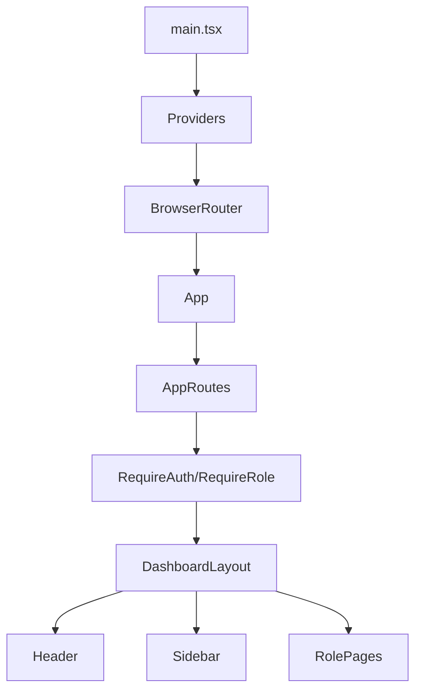
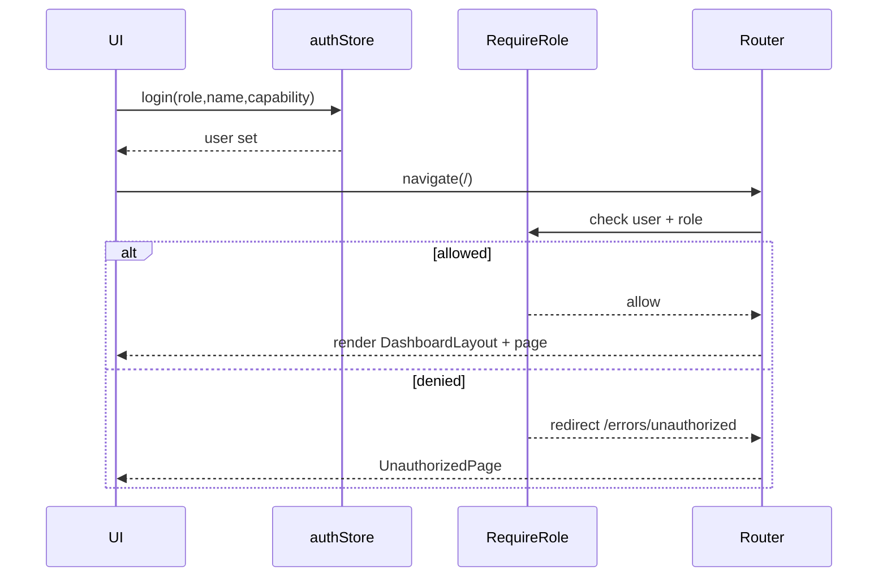
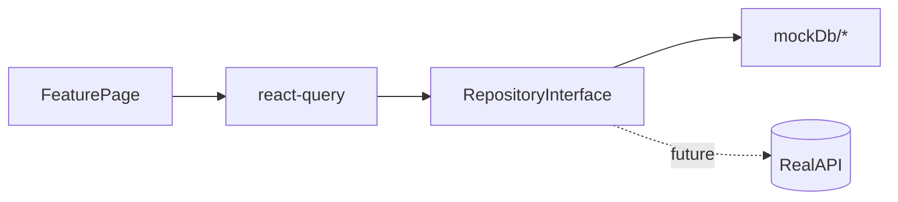

## EVzone Portal (Aggregator & CPMS)

A role-based admin/ops portal built with **Vite + React + TypeScript**, using **Tailwind CSS** for styling and **mocked data** to simulate real analytics dashboards (Admin, Operator, Owners, Site Owners, Station roles, Technicians).

### Highlights
- **Role-based navigation (RBAC)** with route guards
- **Dashboard layouts per role** with realistic mocked KPIs, tables, queues, and maps
- **Global theming** via Tailwind tokens + a typed theme object
- **Data layer** wired with `@tanstack/react-query` (mock repositories today; ready for real APIs later)

---

## Quick Start

### Prerequisites
- Node.js (LTS recommended)
- npm (comes with Node)

### Install
```bash
npm install
```

### Run (dev)
```bash
npm run dev
```

App runs at `http://localhost:5173/`.

### Build (production)
```bash
npm run build
```

### Preview build
```bash
npm run preview
```

---

## Scripts
- **`npm run dev`**: start Vite dev server
- **`npm run build`**: typecheck + build production bundle
- **`npm run preview`**: preview the production build locally
- **`npm run lint`**: run ESLint

---

## Project Structure

```text
src/
  app/                  App shell, layouts, providers, routing
  core/                 Auth, scope, config, shared domain types
  data/                 Mock DB + repository interfaces + react-query keys
  features/             Role-based features and dashboards
  pages/                Auth, errors, landing, onboarding
  ui/
    components/         Reusable UI components (Card, Header, Sidebar, maps)
    theme.ts            Typed theme tokens (aligned with Tailwind + CSS)
    theme/              Theme provider/hook (context)
styles.css              Tailwind layers + component primitives (.btn, .card, .table…)
```

---

## Architecture (High-Level)

### Routing & Layout


### Auth & RBAC Flow


### Data Layer (Mock Today, API Tomorrow)


---

## Theming & UI System

### Where the theme lives
- **Tailwind tokens**: `tailwind.config.cjs`
- **Global CSS primitives**: `src/styles.css` (`@layer components` defines `.btn`, `.card`, `.panel`, `.table`, `.pill`, etc.)
- **Typed theme object**: `src/ui/theme.ts`
- **Theme provider + hook**: `src/ui/theme/provider.tsx`

### Usage
To access the theme anywhere:
```ts
import { useTheme } from '@/ui/theme/provider'

const t = useTheme()
console.log(t.colors.accent.DEFAULT)
```

Note: There is both a **file** `src/ui/theme.ts` and a **folder** `src/ui/theme/`. The provider/hook is imported from `@/ui/theme/provider`.

---

## Dashboards & Mock Analytics

Dashboards are implemented under `src/features/<role>/...` and use mocked datasets to simulate:
- KPIs (stations, sessions, revenue, SLA, incidents)
- Queues (incidents, dispatches, compliance items)
- Tables and drill-downs
- Real “map feel” components:
  - **`WorldChoroplethMap`**: real world country outlines (TopJSON) shaded by region metrics (composite or per-metric)
  - **`StationsHeatMap`**: world map + station dots (status/health/incidents hover details)

Mock data lives in `src/data/mockDb/*` and some pages keep self-contained mocks for UI prototyping.

---

## Adding Real APIs Later

Recommended path:
1. Keep the **repository interfaces** in `src/data/repositories/interfaces/*`.
2. Implement API-backed repositories (e.g., `src/data/repositories/http/*`).
3. Replace mock calls behind the same interfaces without changing pages.

---

## Contributing

### Commit hygiene
- Keep commits focused and descriptive.
- Run `npm run build` before pushing.

### Line endings (Windows)
You may see warnings about `LF` ↔ `CRLF`. They’re generally safe on Windows unless you enforce strict LF via `.gitattributes`.

---

## License

Proprietary / internal by default unless you add a LICENSE file.


